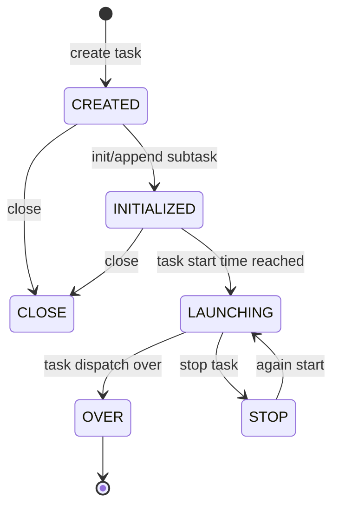

# dispatch
Split and schedule tasks to different systems

### Task Status Circulation

```mermaid
stateDiagram-v2
    [*] --> CREATED : create task
    CREATED --> INITIALIZED : init/append subtask
    CREATED --> CLOSE : close
    INITIALIZED --> LAUNCHING :task start time reached
    INITIALIZED --> CLOSE : close
    LAUNCHING --> OVER : task dispatch over
    LAUNCHING --> STOP : stop task 
    STOP --> LAUNCHING : again start
    OVER --> [*]
```

